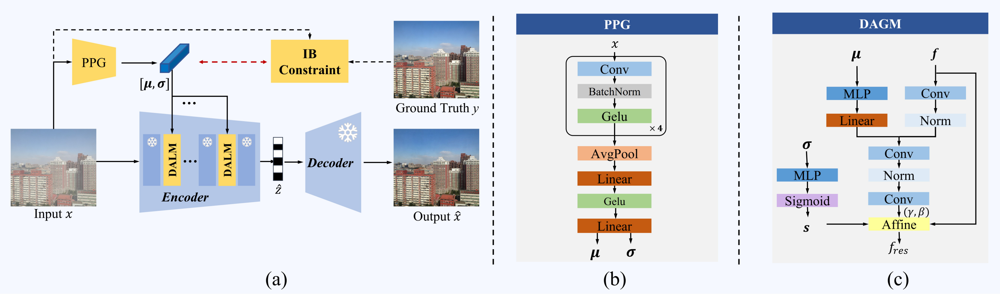

# Prompt-Guided Alignment with Information Bottleneck Makes Image Compression Also a Restorer

[](https://nips.cc/)
[](https://github.com/liuquan0521-sys/IB-LRU-compression)

NeurIPS 2025 paper: "**Prompt-Guided Alignment with Information Bottleneck Makes Image Compression Also a Restorer**".


## News
* **[2025-10-17]** Our paper has been accepted by **NeurIPS 2025**!
* **[2025-12-8]** Code and pretrained models are released.

---

## Abstract
Learned Image Compression (LIC) models often suffer from reduced efficiency when handling degraded images (e.g., rain, fog, noise) due to distribution mismatches. Retraining dedicated models for every degradation is costly.In this paper, we propose an **Information Bottleneck-constrained Latent Representation Unifying (IB-LRU)** scheme. It is a lightweight, plug-and-play module that aligns the latent distribution of degraded images with clean ones without modifying the backbone LIC parameters.


---

## Requirements

* Python >= 3.10
* PyTorch >= 2.1

## Data Preparation

Please organize your datasets into the following directory structure:

```
data/
├── train/
│   ├── denoise/    
│   ├── dehazy/     
│   ├── derainL/    
│   └── derainH/    
└── test/
    ├── denoise/    
    ├── dehazy/   
    ├── derainL/   
    └── derainH/    
```

## Training

To train the IB-LRU module on a frozen LIC backbone (e.g., TIC) with the Information Bottleneck constraint:

```
python train.py
```
## Testing

Download the pretrained checkpoint here: [Download Link](https://drive.google.com/file/d/1kCFr_1NjUs7uaNxpHTMwTIhmoO-Pnyj2/view?usp=sharing) and place it in `checkpoints/`.

To evaluate the model:
```
python test.py --detype
```
```--detype```: Select the degradation type for testing (e.g., derain, dehaze, denoise).
  
## Contact

Should you have any questions, please contact [liuquan0521@gmail.com](mailto:liuquan0521@gmail.com).

**Acknowledgment:** This code is based on the [PromptIR](https://github.com/va1shn9v/PromptIR?tab=readme-ov-file) and [TIC](https://github.com/lumingzzz/TIC) repositories. 